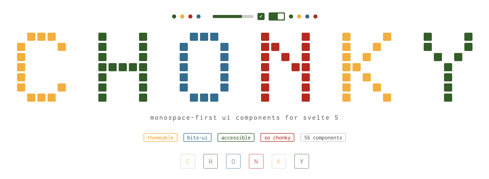

<p align="center">
  
</p>

# chonky

A monospace-first UI component library for Svelte 5.

**[See it in action — live style guide with all components](https://chrissnell.com/styles/chonky/)**

Chonky wraps [bits-ui](https://bits-ui.com) (headless, accessible primitives) with an opinionated design system: Inconsolata everywhere, sharp 2px corners, no shadows, no gradients.

## Design principles

- **Monospace everything** — Inconsolata across all text, inputs, and UI chrome
- **Themeable** — light and dark themes via `data-theme` on `<html>`, with localStorage persistence
- **Minimal decoration** — 1px solid borders, 1px dotted for subtle separators, no box shadows
- **CSS custom properties** — all tokens (colors, spacing, typography, radii) are overridable
- **Accessible** — keyboard navigation and ARIA via bits-ui

## Install

The package is published to [GitHub Packages](https://github.com/chrissnell/chonky/pkgs/npm/chonky-ui). Configure your project to use the GitHub npm registry for the `@chrissnell` scope:

```bash
echo "@chrissnell:registry=https://npm.pkg.github.com" >> .npmrc
```

Then install:

```bash
npm install @chrissnell/chonky-ui bits-ui @internationalized/date
```

## Setup

Import the stylesheet in your root layout:

```svelte
<!-- src/routes/+layout.svelte -->
<script>
  import '@chrissnell/chonky-ui/css';
</script>
```

To import only the design tokens (custom properties) without component styles:

```svelte
<script>
  import '@chrissnell/chonky-ui/tokens';
</script>
```

## Quick example

```svelte
<script>
  import { Button, Badge, Input, Modal, Toggle } from '@chrissnell/chonky-ui';

  let modalOpen = $state(false);
</script>

<Button variant="primary" onclick={() => modalOpen = true}>
  Open settings
</Button>

<Badge variant="success">online</Badge>

<Input placeholder="Search..." />

<Modal.Root bind:open={modalOpen}>
  <Modal.Header>Settings</Modal.Header>
  <Modal.Body>
    <Toggle label="Dark mode" checked />
  </Modal.Body>
  <Modal.Footer>
    <Button onclick={() => modalOpen = false}>Close</Button>
  </Modal.Footer>
</Modal.Root>
```

## Components

56 components across six categories:

| Category | Components |
|---|---|
| **Core** | Button, Badge, Input, Select, Toggle, Radio, RadioGroup, Box, BoxHeader, Table, Label, Separator, Spinner, Dot, StatusBar, EmptyState, ApplyBanner, ThemeToggle |
| **Navigation & Layout** | Tabs, Breadcrumb, Pagination, Accordion, Collapsible, Toolbar, ScrollArea, NavigationMenu, Menubar |
| **Overlays** | Tooltip, Popover, DropdownMenu, ContextMenu, Command, AlertDialog, LinkPreview, Combobox, Listbox, Modal |
| **Form & Data** | Checkbox, Slider, Progress, Meter, PinInput, ToggleButton, ToggleGroup, RatingGroup, Avatar, AspectRatio |
| **Date & Time** | Calendar, RangeCalendar, DateField, DatePicker, DateRangeField, DateRangePicker, TimeField, TimeRangeField |
| **Utilities** | LogViewer, Toast, Toaster |

Compound components (Tabs, Modal, Accordion, etc.) use the `Component.Sub` pattern:

```svelte
<script>
  import { Tabs } from '@chrissnell/chonky-ui';
</script>

<Tabs.Root value="one">
  <Tabs.List>
    <Tabs.Trigger value="one">First</Tabs.Trigger>
    <Tabs.Trigger value="two">Second</Tabs.Trigger>
  </Tabs.List>
  <Tabs.Content value="one">First tab content</Tabs.Content>
  <Tabs.Content value="two">Second tab content</Tabs.Content>
</Tabs.Root>
```

## Theming

Chonky uses CSS custom properties for all tokens. Override them to customize:

```css
:root {
  --color-primary: #7c3aed;
  --color-accent: #059669;
  --font-mono: 'JetBrains Mono', monospace;
  --radius: 4px;
}
```

Switch between dark and light themes by setting `data-theme` on `<html>`:

```js
document.documentElement.setAttribute('data-theme', 'light');
```

Or use the built-in `ThemeToggle` component which handles localStorage persistence.

## Repository structure

```
chonky/
├── packages/
│   ├── chonky-ui/      # the component library (published to GitHub Packages)
│   └── docs/           # SvelteKit documentation site
├── styleguide/         # pure HTML/CSS/JS design reference
└── pnpm-workspace.yaml
```

## Development

```bash
pnpm install
pnpm build          # build all packages
```

To work on the docs site:

```bash
cd packages/docs
pnpm dev
```

To open the static style guide, open `styleguide/index.html` in a browser.

## Releasing

Releases are automated via GitHub Actions. When a `v*` tag is pushed, the workflow builds the package and publishes it to GitHub Packages.

```bash
make patch           # bump 0.1.0 → 0.1.1, commit, and tag
make minor           # bump 0.1.0 → 0.2.0, commit, and tag
make release         # build and verify before pushing
make push            # push to GitHub, triggering the publish workflow
```

Typical release flow:

```bash
make patch           # or: make minor
make release
make push
```

## License

[MIT](LICENSE)
